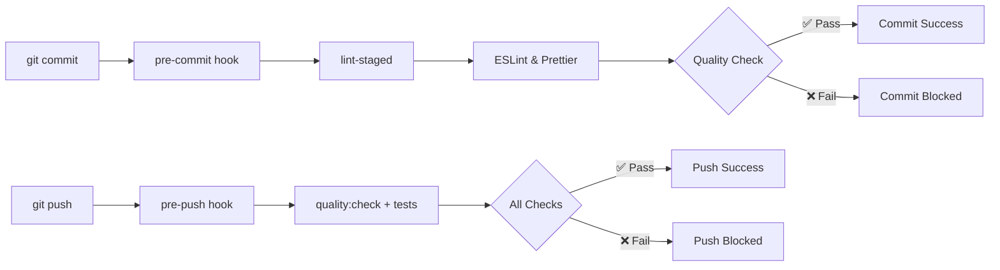

# Husky Git Hooks Guide

This document provides a comprehensive overview of Husky and how it's configured and used in this project.

## Table of Contents

- [What is Husky?](#what-is-husky)
- [Why Use Git Hooks?](#why-use-git-hooks)
- [Project Setup](#project-setup)
- [Configured Hooks](#configured-hooks)
- [Hook Details](#hook-details)
- [Integration with Other Tools](#integration-with-other-tools)
- [Workflow Examples](#workflow-examples)
- [Troubleshooting](#troubleshooting)
- [Best Practices](#best-practices)
- [Advanced Usage](#advanced-usage)

## What is Husky?

**Husky** is a tool that makes it easy to use **Git hooks** in your JavaScript/TypeScript projects. Git hooks are scripts that run automatically at specific points in the Git workflow (like before commits or pushes).

> Husky improves your commits and more 🐶 **woof!**

### Key Benefits

- **Prevents bad commits**: Runs quality checks before code is committed
- **Enforces standards**: Automatically formats and lints code
- **Team consistency**: Ensures all team members follow the same quality standards
- **Early error detection**: Catches issues before they reach the repository
- **Automated workflows**: Reduces manual quality assurance tasks

### How it works



## Why Use Git Hooks?

### Without Git Hooks ❌

```bash
# Developer commits without checking
git add .
git commit -m "fix: update user service"  # ❌ May contain linting errors
git push                                   # ❌ May break CI/CD pipeline

# Problems discovered later:
# - Linting errors in CI
# - Test failures in CI
# - Inconsistent code formatting
# - Type errors
```

### With Husky Git Hooks ✅

```bash
# Developer commits with automatic quality checks
git add .
git commit -m "fix: update user service"

# Husky automatically runs:
# 1. ESLint fixes code issues ✅
# 2. Prettier formats code ✅
# 3. Only allows commit if everything passes ✅

git push

# Husky automatically runs:
# 1. Full quality check ✅
# 2. All tests ✅
# 3. Only allows push if everything passes ✅
```

## Project Setup

### Installation

Husky is already configured in this project:

```json
{
  "devDependencies": {
    "husky": "^9.1.7", // Git hooks manager
    "lint-staged": "^16.2.3" // Run linters on staged files
  },
  "scripts": {
    "prepare": "husky", // Auto-install hooks when installing deps
    "pre-commit": "lint-staged", // Script run by pre-commit hook
    "pre-push": "pnpm quality:check && pnpm test --passWithNoTests"
  }
}
```

### Automatic Installation

Husky hooks are automatically installed when:

```bash
# Installing dependencies (runs "prepare" script)
pnpm install

# Manual installation (if needed)
pnpm run prepare
```

### Project Structure

```
backend-services/
├── .husky/                    # Husky configuration directory
│   ├── _/                     # Husky internal files
│   ├── pre-commit            # Pre-commit hook script
│   └── pre-push              # Pre-push hook script
├── package.json              # Husky scripts and dependencies
└── eslint-staged.config.mjs  # lint-staged configuration
```

## Configured Hooks

### 1. Pre-commit Hook

**Location**: `.husky/pre-commit`

**Content**:

```bash
pnpm lint-staged
```

**Triggers**: Before every `git commit`

**Purpose**: Ensures code quality on staged files only

### 2. Pre-push Hook

**Location**: `.husky/pre-push`

**Content**:

```bash
pnpm quality:check && pnpm test --passWithNoTests
```

**Triggers**: Before every `git push`

**Purpose**: Ensures entire codebase quality and tests pass

## Hook Details

### Pre-commit Hook Workflow

```bash
# When you run: git commit -m "message"
# Husky executes: pnpm lint-staged

# lint-staged configuration (eslint-staged.config.mjs):
{
  "*.{ts,tsx}": [
    "pnpm exec eslint --fix --config eslint-staged.config.mjs"
  ],
  "*.{json,md,yml,yaml}": [
    "prettier --write"
  ]
}
```

#### What happens

1. **Identifies staged files**: Only processes files you've `git add`ed
2. **TypeScript files**: Runs ESLint with auto-fix
3. **JSON/Markdown files**: Runs Prettier formatting
4. **Auto-stages fixes**: Automatically adds fixed files back to staging
5. **Commit proceeds**: If all checks pass
6. **Commit blocked**: If any check fails

#### Example Flow

```bash
# You stage files with issues
git add src/user.service.ts     # Has linting errors
git add README.md               # Has formatting issues

# Attempt to commit
git commit -m "feat: add user service"

# Husky runs lint-staged:
# ✅ Fixes ESLint issues in user.service.ts
# ✅ Formats README.md with Prettier
# ✅ Auto-stages the fixed files
# ✅ Commit proceeds with clean code
```

### Pre-push Hook Workflow

```bash
# When you run: git push
# Husky executes: pnpm quality:check && pnpm test --passWithNoTests

# Breaking down the command:
# 1. pnpm quality:check = pnpm lint:check && pnpm format:check && pnpm type:check
# 2. pnpm test --passWithNoTests
```

#### What happens

1. **Lint Check**: `eslint "{apps,libs}/**/*.ts"` - No auto-fix, just validation
2. **Format Check**: `prettier --check "{apps,libs}/**/*.{ts,json}"` - Verify formatting
3. **Type Check**: `tsc --noEmit` - TypeScript compilation check
4. **Test Execution**: Runs all tests, passes if no test files exist
5. **Push proceeds**: Only if ALL checks pass
6. **Push blocked**: If any check fails

#### Example Flow

```bash
# Attempt to push
git push origin feature/user-management

# Husky runs quality checks:
# ✅ ESLint validation on all TypeScript files
# ✅ Prettier validation on all relevant files
# ✅ TypeScript compilation check
# ✅ Jest test execution
# ✅ Push proceeds to remote repository

# If any check fails:
# ❌ Push is blocked
# 🔧 Fix issues locally
# 🔁 Try push again
```

## Integration with Other Tools

### ESLint Integration

```javascript
// eslint-staged.config.mjs - Special config for pre-commit
export default {
  '*.{ts,tsx}': [
    'pnpm exec eslint --fix --config eslint-staged.config.mjs'
  ]
};

// Regular eslint.config.mjs - Full project linting
export default [
  {
    files: ['**/*.{js,mjs,cjs,ts}'],
    // ... full ESLint configuration
  }
];
```

### Prettier Integration

```json
// package.json - lint-staged configuration
{
  "lint-staged": {
    "*.{json,md,yml,yaml}": ["prettier --write"]
  }
}
```

### Jest Integration

```bash
# Pre-push runs tests with special flag
pnpm test --passWithNoTests

# Benefits:
# - Runs all tests before push
# - Doesn't fail if no test files exist (--passWithNoTests)
# - Ensures code changes don't break existing functionality
```

### NestJS Integration

Husky works seamlessly with NestJS projects:

```bash
# Validates NestJS-specific patterns
# - Decorators (@Injectable, @Controller, etc.)
# - Dependency injection
# - Module imports/exports
# - gRPC service definitions
```

## Workflow Examples

### Typical Development Workflow

```bash
# 1. Make changes to files
vim src/users/users.service.ts

# 2. Stage changes
git add src/users/users.service.ts

# 3. Commit (triggers pre-commit hook)
git commit -m "feat: add user validation"

# Pre-commit automatically:
# - Fixes any ESLint issues
# - Formats code with Prettier
# - Stages the fixed files
# - Commits if everything passes

# 4. Push (triggers pre-push hook)
git push origin feature/user-validation

# Pre-push automatically:
# - Runs full quality checks
# - Runs all tests
# - Pushes if everything passes
```

### Working with Multiple Files

```bash
# Stage multiple files
git add .

# Commit triggers pre-commit on all staged files
git commit -m "refactor: update user module"

# lint-staged processes each file type:
# TypeScript files: ESLint --fix
# JSON files: Prettier --write
# Markdown files: Prettier --write
# YAML files: Prettier --write
```

### Handling Hook Failures

```bash
# If pre-commit fails:
git commit -m "fix: user service"
# ❌ ESLint found unfixable errors
# 🔧 Fix the errors manually
# 🔁 Try commit again

# If pre-push fails:
git push
# ❌ Tests are failing
# 🔧 Fix failing tests
# ✅ git push (try again)
```

## Troubleshooting

### Common Issues

#### 1. **Husky not installed**

**Problem**: Git hooks not running

**Solution**:

```bash
# Reinstall Husky
pnpm run prepare

# Or reinstall dependencies
rm -rf node_modules pnpm-lock.yaml
pnpm install
```

#### 2. **ESLint errors in pre-commit**

**Problem**:

```bash
git commit
# ❌ ESLint found errors that couldn't be auto-fixed
```

**Solution**:

```bash
# Run ESLint manually to see errors
pnpm lint:check

# Fix errors manually
# Then try commit again
git commit -m "your message"
```

#### 3. **Tests failing in pre-push**

**Problem**:

```bash
git push
# ❌ Test suites: 1 failed, 0 passed, 1 total
```

**Solution**:

```bash
# Run tests locally to debug
pnpm test

# Fix failing tests
# Then try push again
git push
```

#### 4. **TypeScript compilation errors**

**Problem**:

```bash
git push
# ❌ Found 3 errors in src/users/users.service.ts
```

**Solution**:

```bash
# Check TypeScript errors
pnpm type:check

# Fix compilation errors
# Then try push again
```

#### 5. **Prettier formatting issues**

**Problem**:

```bash
git push
# ❌ Code style issues found in the above file(s)
```

**Solution**:

```bash
# Format files automatically
pnpm format:write

# Stage the formatted files
git add .

# Try push again
git push
```

### Bypassing Hooks (Emergency Use Only)

```bash
# Skip pre-commit hook (not recommended)
git commit --no-verify -m "emergency fix"

# Skip pre-push hook (not recommended)
git push --no-verify
```

⚠️ **Warning**: Only use `--no-verify` in genuine emergencies. It defeats the purpose of quality assurance.

### Debugging Hooks

```bash
# Test pre-commit manually
pnpm run pre-commit

# Test pre-push manually
pnpm run pre-push

# Run individual quality checks
pnpm lint:check
pnpm format:check
pnpm type:check
pnpm test
```

## Best Practices

### 1. **Keep Hooks Fast**

```bash
# ✅ Good: Only process staged files in pre-commit
lint-staged runs only on changed files

# ❌ Avoid: Processing entire codebase in pre-commit
# This would make commits slow
```

### 2. **Use Auto-fixing When Possible**

```javascript
// ✅ Good: Auto-fix in pre-commit
"*.{ts,tsx}": ["eslint --fix"]

// ✅ Good: Check-only in pre-push
"pnpm lint:check"  // No --fix flag
```

### 3. **Separate Concerns**

- **Pre-commit**: Fast, staged files only, auto-fix issues
- **Pre-push**: Comprehensive, entire codebase, validation only

### 4. **Meaningful Commit Messages**

```bash
# ✅ Good: Clear, descriptive messages
git commit -m "feat: add user authentication middleware"
git commit -m "fix: resolve memory leak in user service"

# ❌ Avoid: Vague messages
git commit -m "update stuff"
git commit -m "fixes"
```

### 5. **Test Hooks Locally**

```bash
# Before pushing to shared branches, test hooks work:
git commit -m "test: verify hooks are working"
git push origin feature-branch
```

### 6. **Keep Dependencies Updated**

```bash
# Regularly update Husky and related tools
pnpm update husky lint-staged

# Check for outdated packages
pnpm outdated
```

## Advanced Usage

### Custom Hook Scripts

You can add custom hooks beyond pre-commit and pre-push:

```bash
# Create custom hook
echo "echo 'Custom pre-receive hook'" > .husky/pre-receive
chmod +x .husky/pre-receive
```

### Conditional Hook Execution

```bash
# .husky/pre-commit - Run different checks based on files
#!/usr/bin/env sh
. "$(dirname -- "$0")/_/husky.sh"

if git diff --cached --name-only | grep -q "\.proto$"; then
  echo "Proto files detected, running proto validation..."
  pnpm proto:validate
fi

pnpm lint-staged
```

### Environment-Specific Hooks

```bash
# .husky/pre-push - Different behavior by branch
#!/usr/bin/env sh
. "$(dirname -- "$0")/_/husky.sh"

BRANCH=$(git branch --show-current)

if [ "$BRANCH" = "main" ] || [ "$BRANCH" = "develop" ]; then
  echo "Protected branch detected, running full test suite..."
  pnpm test:cov
  pnpm quality:check
else
  echo "Feature branch, running standard checks..."
  pnpm quality:check && pnpm test --passWithNoTests
fi
```

### Integration with CI/CD

```yaml
# .github/workflows/ci.yml - Ensure same checks in CI
name: CI
on: [push, pull_request]

jobs:
  quality:
    runs-on: ubuntu-latest
    steps:
      - uses: actions/checkout@v3
      - uses: actions/setup-node@v3
        with:
          node-version: '18'
      - run: pnpm install
      - run: pnpm quality:check # Same as pre-push hook
      - run: pnpm test # Same as pre-push hook
```

## Conclusion

Husky provides **automated quality assurance** for this NestJS project by:

### Key Benefits in This Project

- **Pre-commit**: Ensures clean, formatted code with every commit
- **Pre-push**: Validates entire codebase before sharing changes
- **Team Consistency**: All developers follow same quality standards
- **Early Detection**: Catches issues before CI/CD pipeline
- **Reduced CI Failures**: Fewer failed builds due to quality issues

### Integration Summary

| Tool            | Purpose                | Hook Integration                            |
| --------------- | ---------------------- | ------------------------------------------- |
| **ESLint**      | Code quality & style   | Pre-commit (auto-fix) + Pre-push (validate) |
| **Prettier**    | Code formatting        | Pre-commit (format) + Pre-push (validate)   |
| **TypeScript**  | Type checking          | Pre-push (compile check)                    |
| **Jest**        | Testing                | Pre-push (run tests)                        |
| **lint-staged** | Staged file processing | Pre-commit (optimize performance)           |

### Project-Specific Configuration

```bash
# This project's Husky setup enforces:
✅ Automatic ESLint fixes on commit
✅ Automatic Prettier formatting on commit
✅ Full quality validation before push
✅ All tests must pass before push
✅ TypeScript must compile without errors
✅ Consistent code style across team
```

Husky is **essential** for maintaining high code quality in this NestJS backend project and ensuring smooth collaboration across the development team.
