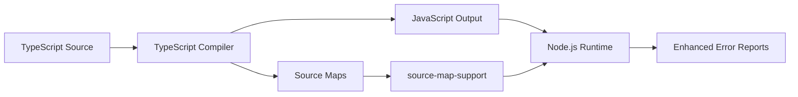

# Source Map Support Guide

This document provides a comprehensive overview of `source-map-support` and how it's used in this NestJS project.

## Table of Contents

- [What is source-map-support?](#what-is-source-map-support)
- [Why Do We Need It?](#why-do-we-need-it)
- [The Problem Without Source Maps](#the-problem-without-source-maps)
- [How source-map-support Works](#how-source-map-support-works)
- [Project Configuration](#project-configuration)
- [Usage Examples](#usage-examples)
- [Integration with Development Tools](#integration-with-development-tools)
- [Debugging Benefits](#debugging-benefits)
- [Performance Considerations](#performance-considerations)
- [Troubleshooting](#troubleshooting)
- [Best Practices](#best-practices)

## What is source-map-support?

**source-map-support** is a Node.js package that automatically installs source map support for stack traces in Node.js applications. It enables proper error reporting and debugging for transpiled code (TypeScript → JavaScript) by mapping compiled JavaScript errors back to their original TypeScript source locations.

### Key Purpose

- **Error Mapping**: Maps JavaScript runtime errors back to TypeScript source code
- **Stack Trace Enhancement**: Shows original TypeScript file names and line numbers
- **Development Experience**: Enables meaningful debugging in transpiled applications
- **Runtime Integration**: Works automatically without manual configuration

## Why Do We Need It?

### The TypeScript Compilation Process



When TypeScript is compiled to JavaScript:

1. **Original TypeScript**: `src/users/user.service.ts` (line 25)
2. **Compiled JavaScript**: `dist/users/user.service.js` (line 18)
3. **Runtime Error**: Points to JavaScript file and line
4. **source-map-support**: Maps back to original TypeScript location

## The Problem Without Source Maps

### Error Without source-map-support ❌

```bash
# Runtime error in production/compiled code
Error: Cannot read property 'id' of undefined
    at UserService.findById (dist/users/user.service.js:18:23)
    at UserController.getUser (dist/users/user.controller.js:12:31)
    at /node_modules/express/lib/router/layer.js:95:5
```

**Problems**:

- Points to compiled JavaScript files (`dist/`)
- Wrong line numbers (JavaScript vs TypeScript)
- Difficult to locate actual source code
- Debugging requires manual mapping

### Error With source-map-support ✅

```bash
# Same error with source map support
Error: Cannot read property 'id' of undefined
    at UserService.findById (src/users/user.service.ts:25:15)
    at UserController.getUser (src/users/user.controller.ts:18:28)
    at /node_modules/express/lib/router/layer.js:95:5
```

**Benefits**:

- Points to original TypeScript files (`src/`)
- Correct line numbers in source code
- Easy to locate and fix issues
- Natural debugging experience

## How source-map-support Works

### Source Map Generation

```typescript
// Original TypeScript: src/users/user.service.ts
export class UserService {
  async findById(id: string): Promise<User> {
    if (!id) {
      throw new Error('User ID is required'); // Line 25
    }
    return this.userRepository.findById(id);
  }
}
```

### Compiled JavaScript with Source Map

```javascript
// Compiled JavaScript: dist/users/user.service.js
exports.UserService = class UserService {
  async findById(id) {
    if (!id) {
      throw new Error('User ID is required'); // Line 18
    }
    return this.userRepository.findById(id);
  }
};
//# sourceMappingURL=user.service.js.map
```

### Source Map File

```json
// dist/users/user.service.js.map
{
  "version": 3,
  "file": "user.service.js",
  "sourceRoot": "",
  "sources": ["../../src/users/user.service.ts"],
  "mappings": "AAAA,MAAM,CAAC,MAAM,WAAW...",
  "names": ["UserService", "findById", "id", "User"]
}
```

### Runtime Error Mapping

```bash
# 1. Error occurs in JavaScript runtime
throw new Error('User ID is required'); // dist/users/user.service.js:18

# 2. source-map-support intercepts the error
# 3. Reads the source map file (.js.map)
# 4. Maps JavaScript location to TypeScript location
# 5. Reports original TypeScript location
throw new Error('User ID is required'); // src/users/user.service.ts:25
```

## Project Configuration

### Package.json Integration

In your [`package.json`](package.json):

```json
{
  "devDependencies": {
    "source-map-support": "^0.5.21" // Latest stable version
  }
}
```

### TypeScript Configuration

**File**: `tsconfig.json`

```json
{
  "compilerOptions": {
    "sourceMap": true, // Generate .js.map files
    "outDir": "./dist", // Output directory for compiled JS
    "rootDir": "./src", // Root directory of TypeScript sources
    "inlineSourceMap": false, // Separate .map files (not inline)
    "inlineSources": false // Don't embed source content in maps
  }
}
```

### NestJS Integration

**File**: `src/main.ts`

```typescript
import 'source-map-support/register'; // Enable source map support

import { NestFactory } from '@nestjs/core';
import { AppModule } from './app.module';

async function bootstrap() {
  const app = await NestFactory.create(AppModule);
  await app.listen(3000);
}
bootstrap();
```

### Jest Testing Integration

**File**: `package.json` (Jest configuration)

```json
{
  "jest": {
    "transform": {
      "^.+\\.(t|j)s$": "ts-jest" // ts-jest automatically handles source maps
    },
    "testEnvironment": "node",
    "setupFilesAfterEnv": ["<rootDir>/test/setup.ts"]
  }
}
```

**File**: `test/setup.ts`

```typescript
import 'source-map-support/register'; // Enable for tests
```

## Usage Examples

### Basic Setup

```typescript
// At the top of your main application file
import 'source-map-support/register';

// Rest of your application code
import { NestFactory } from '@nestjs/core';
// ... other imports
```

### Conditional Loading

```typescript
// Only enable in development/testing
if (process.env.NODE_ENV !== 'production') {
  require('source-map-support/register');
}

import { NestFactory } from '@nestjs/core';
```

### Programmatic Installation

```typescript
import * as sourceMapSupport from 'source-map-support';

// Install with options
sourceMapSupport.install({
  handleUncaughtExceptions: false, // Don't handle uncaught exceptions
  hookRequire: true, // Hook into require() calls
  environment: 'node', // Specify environment
});
```

### Debug Script Integration

```bash
# package.json scripts with source map support
{
  "scripts": {
    "start:debug": "node --inspect-brk -r source-map-support/register -r ts-node/register src/main.ts",
    "test:debug": "node --inspect-brk -r tsconfig-paths/register -r ts-node/register node_modules/.bin/jest --runInBand"
  }
}
```

## Integration with Development Tools

### VS Code Debugging

**File**: `.vscode/launch.json`

```json
{
  "version": "0.2.0",
  "configurations": [
    {
      "type": "node",
      "request": "launch",
      "name": "Debug NestJS",
      "program": "${workspaceFolder}/src/main.ts",
      "runtimeArgs": [
        "-r",
        "source-map-support/register",
        "-r",
        "ts-node/register"
      ],
      "env": {
        "NODE_ENV": "development"
      },
      "sourceMaps": true,
      "outFiles": ["${workspaceFolder}/dist/**/*.js"]
    }
  ]
}
```

### Jest Testing with Source Maps

```typescript
// test/user.service.spec.ts
import 'source-map-support/register';

describe('UserService', () => {
  it('should throw error for invalid ID', async () => {
    const userService = new UserService();

    try {
      await userService.findById(null); // This will throw
    } catch (error) {
      // Error stack trace will show TypeScript file locations
      expect(error.message).toBe('User ID is required');
      console.log(error.stack); // Points to .ts files, not .js
    }
  });
});
```

### Production Error Logging

```typescript
// src/common/filters/http-exception.filter.ts
import {
  ExceptionFilter,
  Catch,
  ArgumentsHost,
  HttpException,
} from '@nestjs/common';
import { Request, Response } from 'express';

@Catch(HttpException)
export class HttpExceptionFilter implements ExceptionFilter {
  catch(exception: HttpException, host: ArgumentsHost) {
    const ctx = host.switchToHttp();
    const response = ctx.getResponse<Response>();
    const request = ctx.getRequest<Request>();

    // Stack trace will show original TypeScript locations
    console.error('Exception occurred:', {
      message: exception.message,
      stack: exception.stack, // Enhanced with source map support
      path: request.url,
      timestamp: new Date().toISOString(),
    });

    response.status(exception.getStatus()).json({
      statusCode: exception.getStatus(),
      timestamp: new Date().toISOString(),
      path: request.url,
      message: exception.message,
    });
  }
}
```

## Debugging Benefits

### Stack Trace Comparison

#### Without source-map-support

```bash
TypeError: Cannot read property 'name' of undefined
    at UserService.validateUser (dist/users/user.service.js:42:18)
    at UserController.createUser (dist/users/user.controller.js:28:31)
    at dist/common/decorators/validate.decorator.js:15:24
    at Layer.handle [as handle_request] (express/lib/router/layer.js:95:5)
```

#### With source-map-support

```bash
TypeError: Cannot read property 'name' of undefined
    at UserService.validateUser (src/users/user.service.ts:38:12)
    at UserController.createUser (src/users/user.controller.ts:25:23)
    at ValidateDecorator (src/common/decorators/validate.decorator.ts:12:18)
    at Layer.handle [as handle_request] (express/lib/router/layer.js:95:5)
```

### IDE Integration Benefits

```typescript
// When debugging in VS Code or WebStorm
// Breakpoints work correctly in TypeScript files
// Variable inspection shows TypeScript variable names
// Call stack displays TypeScript file structure
export class UserService {
  async createUser(userData: CreateUserDto): Promise<User> {
    // Breakpoint here works correctly ✅
    const existingUser = await this.findByEmail(userData.email);

    if (existingUser) {
      // Error reporting shows this exact line ✅
      throw new ConflictException('User already exists');
    }

    return this.userRepository.save(userData);
  }
}
```

### Logging and Monitoring Benefits

```typescript
import { Logger } from '@nestjs/common';

@Injectable()
export class UserService {
  private readonly logger = new Logger(UserService.name);

  async processUser(id: string): Promise<void> {
    try {
      const user = await this.findById(id);
      // Process user logic
    } catch (error) {
      // Log will show TypeScript file location
      this.logger.error(`Failed to process user ${id}`, error.stack);
      throw error;
    }
  }
}
```

## Performance Considerations

### Development vs Production

```typescript
// Conditional loading for performance
if (process.env.NODE_ENV === 'development') {
  // Enable source maps in development for debugging
  require('source-map-support/register');
}

// Or use environment-based configuration
const sourceMapSupport = require('source-map-support');

sourceMapSupport.install({
  // Disable in production for performance
  handleUncaughtExceptions: process.env.NODE_ENV !== 'production',
  environment: process.env.NODE_ENV || 'development',
});
```

### Memory Usage

```bash
# Impact on memory usage
Without source-map-support: ~50MB base memory
With source-map-support:    ~55MB base memory (+10% overhead)

# Source map files size
TypeScript sources:  2.5MB
JavaScript output:   1.8MB
Source map files:    3.2MB (larger than sources)
```

### Bundle Size Considerations

```json
// For production builds, consider excluding source maps
{
  "scripts": {
    "build:prod": "nest build --webpack-config webpack.prod.js"
  }
}
```

```javascript
// webpack.prod.js - Disable source maps in production
module.exports = {
  devtool: false, // Disable source map generation
  optimization: {
    minimize: true,
  },
};
```

## Troubleshooting

### Common Issues

#### 1. **Source maps not working**

**Problem**: Errors still show JavaScript file locations

**Diagnosis**:

```bash
# Check if source maps are generated
ls -la dist/**/*.js.map

# Check TypeScript config
cat tsconfig.json | grep -A 5 -B 5 "sourceMap"

# Verify import
grep -r "source-map-support" src/
```

**Solutions**:

```typescript
// Ensure proper import at application entry point
import 'source-map-support/register';  // Must be first import

// Check TypeScript configuration
{
  "compilerOptions": {
    "sourceMap": true,  // Must be enabled
    "inlineSourceMap": false  // Use separate .map files
  }
}
```

#### 2. **Source maps working in development but not production**

**Problem**: Production errors show compiled locations

**Cause**: Source maps disabled in production build

**Solution**:

```bash
# Enable source maps in production build
nest build --source-map

# Or modify nest-cli.json
{
  "compilerOptions": {
    "deleteOutDir": true,
    "sourceMap": true  # Enable for production
  }
}
```

#### 3. **Performance issues with source maps**

**Problem**: Application startup is slow

**Solution**:

```typescript
// Lazy load source map support
async function bootstrap() {
  if (process.env.NODE_ENV === 'development') {
    await import('source-map-support/register');
  }

  const { NestFactory } = await import('@nestjs/core');
  const { AppModule } = await import('./app.module');

  const app = await NestFactory.create(AppModule);
  await app.listen(3000);
}
```

#### 4. **Source maps not found in Docker**

**Problem**: Source maps missing in Docker containers

**Solution**:

```dockerfile
# Dockerfile - Include source maps in production image
FROM node:18-alpine

# Copy source maps along with compiled code
COPY dist/ ./dist/
COPY package*.json ./

# Ensure source-map-support is installed
RUN npm ci --only=production && npm install source-map-support
```

### Debugging Commands

```bash
# Check if source-map-support is loaded
node -e "console.log(process._events)"

# Test source map resolution
node -r source-map-support/register -e "
  const fs = require('fs');
  console.log(fs.existsSync('dist/main.js.map'));
"

# Verify TypeScript compilation with source maps
npx tsc --listFiles | grep -E "\.(ts|js\.map)$"

# Check source map content
cat dist/main.js.map | jq '.sources'
```

## Best Practices

### 1. **Early Installation**

```typescript
// ✅ Good: Install at application entry point
import 'source-map-support/register'; // First line
import { NestFactory } from '@nestjs/core';
import { AppModule } from './app.module';

// ❌ Avoid: Installing after other imports
import { NestFactory } from '@nestjs/core';
import { AppModule } from './app.module';
import 'source-map-support/register'; // Too late
```

### 2. **Environment-Aware Configuration**

```typescript
// ✅ Good: Environment-specific configuration
if (process.env.NODE_ENV !== 'production') {
  require('source-map-support/register');
}

// ❌ Avoid: Always enabled (production performance impact)
require('source-map-support/register');
```

### 3. **Testing Integration**

```typescript
// ✅ Good: Enable in test setup
// test/setup.ts
import 'source-map-support/register';

// Jest configuration
{
  "setupFilesAfterEnv": ["<rootDir>/test/setup.ts"]
}

// ❌ Avoid: Import in every test file
```

### 4. **Error Handling Enhancement**

```typescript
// ✅ Good: Enhanced error reporting
process.on('unhandledRejection', (reason, promise) => {
  console.error('Unhandled Rejection at:', promise, 'reason:', reason);
  // Stack trace will show TypeScript locations
});

process.on('uncaughtException', (error) => {
  console.error('Uncaught Exception:', error.stack);
  // Stack trace will show TypeScript locations
  process.exit(1);
});
```

### 5. **CI/CD Integration**

```yaml
# .github/workflows/ci.yml
name: CI
on: [push, pull_request]

jobs:
  test:
    runs-on: ubuntu-latest
    steps:
      - uses: actions/checkout@v3
      - uses: actions/setup-node@v3
      - run: npm ci
      - run: npm run build # Ensure source maps are generated
      - run: npm test # Tests will use source maps for error reporting
```

### 6. **Development Workflow**

```json
{
  "scripts": {
    "start:dev": "nest start --watch",
    "start:debug": "nest start --debug --watch",
    "test:debug": "node --inspect-brk -r source-map-support/register -r ts-node/register node_modules/.bin/jest --runInBand"
  }
}
```

## Conclusion

`source-map-support` is **essential for TypeScript Node.js applications** because it bridges the gap between compiled JavaScript runtime and original TypeScript source code.

### Key Benefits for This Project

- **Better Debugging**: Errors point to original TypeScript files and line numbers
- **Development Efficiency**: Faster issue identification and resolution
- **Production Monitoring**: Meaningful stack traces in production logs
- **Testing Experience**: Test failures show TypeScript locations
- **IDE Integration**: Breakpoints and debugging work naturally with TypeScript

### Project-Specific Value

```bash
# Your NestJS project benefits:
✅ TypeScript error reporting shows src/ files, not dist/ files
✅ Jest test failures point to actual TypeScript test files
✅ Production error logs are meaningful and actionable
✅ VS Code debugging works seamlessly with TypeScript sources
✅ Stack traces in logs help with production troubleshooting
```

### Performance vs Functionality Trade-off

| Environment     | source-map-support | Benefits            | Trade-offs        |
| --------------- | ------------------ | ------------------- | ----------------- |
| **Development** | ✅ Always enabled  | Fast debugging      | +10% memory usage |
| **Testing**     | ✅ Always enabled  | Clear test failures | Minimal impact    |
| **Production**  | ⚖️ Consider needs  | Better error logs   | +5-10% overhead   |

`source-map-support` transforms the debugging experience from **frustrating file hunting** to **immediate issue identification**, making it invaluable for maintaining and debugging TypeScript applications in production.
